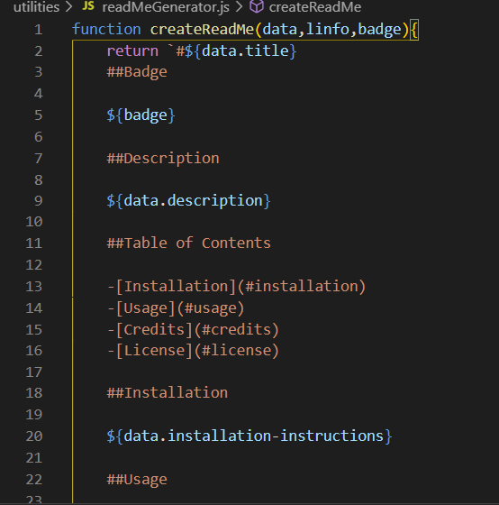
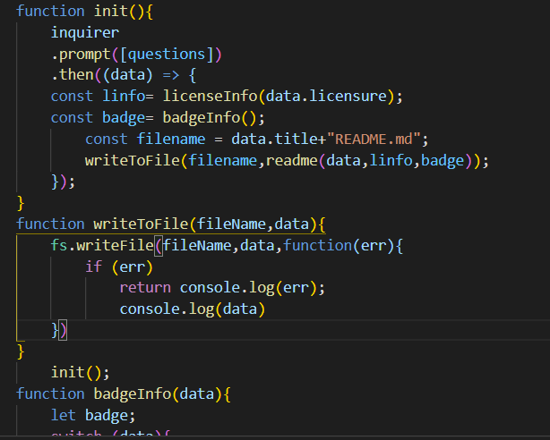

#Zachary's Readme Generator!

##Description

A readme generator soley based on javascript

##Table of Contents

-[Installation](#installation)
-[Usage](#usage)
-[Credits](#credits)
-[License](#license)

##Installation

Simply type in the input prompted.

    
##Usage

you type in input giving the program direction towards creating a readme

##Credits

I worked alone on this project.
    
##Test instructions

you type in input giving the program direction towards creating a readme

##Questions
my Github: taylor67469 (https://github.com/taylor67469)
my email address: taylor67469@yahoo.com
    